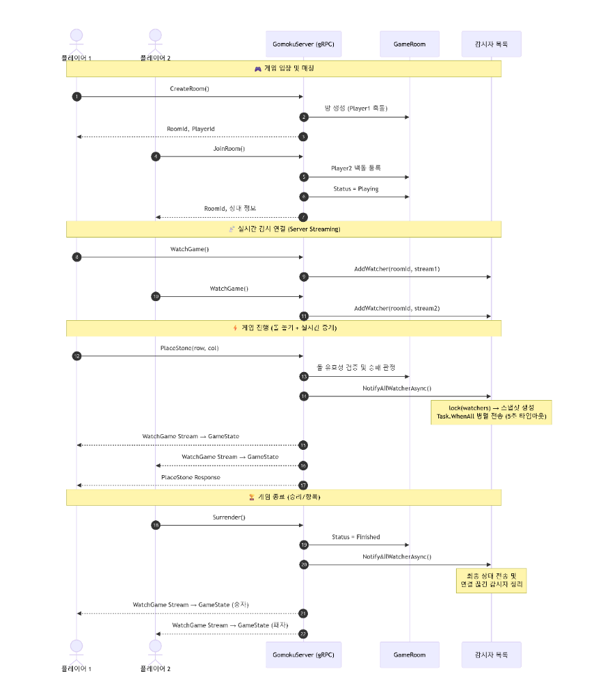

# gRPC 기반 실시간 오목 게임 (Gomoku)

gRPC와 Server-Sent Events (SSE) 기술을 결합하여 가볍고 빠른 실시간 멀티플레이어 환경을 구축한 오목 게임 프로젝트입니다.  
포트폴리오에 활용하기 적합하도록 비동기 통신 처리, 동시성 안전 설계, 그리고 Docker 형태의 배포 모델을 적용하였습니다.


## 시스템 아키텍처

본 프로젝트는 **gRPC 게임 백엔드 서버**와 **웹 클라이언트 서비스**가 네트워크를 통해 통신하는 구조입니다. 실시간 전송을 위해 **gRPC 서버 스트리밍**과 **SSE(Server-Sent Events)**를 사용하였습니다.


##  실시간 흐름 시퀀스

실시간 중계가 진행되는 시퀀스 흐름도입니다.

```
플레이어 1 ──→ gRPC Unary (PlaceStone) ──→ GameRoom (로직 처리)
                                                  │
                  ┌────────────────────────────────┘
                  ▼
         NotifyAllWatcherAsync()
                  │
          ┌───────┴───────┐
          ▼               ▼
      Stream 1        Stream 2
      (P1에게)        (P2에게)
   GameState 전송   GameState 전송
```




## 기술적 도전 및 최적화 

### 1. 방 목록 및 참여자 리스트 관리 
- **문제**: 서버에서 gRPC 스트림 연결을 유지하며 클라이언트에 게임 상태를 실시간으로 전송하기 위해, 방별 커넥션 스트림을 저장하는 컬렉션(_watchers)에 여러 스레드(유저 행동, 관전자 입/퇴장)가 동시에 접근할 때 InvalidOperationException과 같은 컬렉션 수정 예외가 발생할 위험이 있었습니다.
- **접근 및 해결**:
    - 방별 감시대상을 저장하는 리스트 자료형으로 ConcurrentBag<T>을 검토했으나, 여러 스레드가 접근하는 환경에서는 안전하지만 요소의 순서와 상관없이 특정 요소만 Remove하는 연산을 지원하지 않았습니다. 중도 퇴장하거나 연결이 해제된 특정 스트림만 정확히 찾아 제거해야 하므로, 임의 삭제가 용이한 일반 List<T>를 사용하되 동시 접근을 방지하기 위해 lock을 도입하였습니다.
      ```csharp
      // 일반 List<T>를 사용하고 lock을 적용하여 특정 스트림을 중도 퇴장/해제 시 임의 삭제
      lock (watchers)
      {
          watchers.Remove(writer);
      }
      ```
    - 세마포어가 아닌 lock을 선택한 이유는, 임계 구역의 목적이 List에 대한 단순한 추가/삭제 접근을 관리하기 위한 것으로 간결한 연산만 진행하며, 내부에 여러 스레드가 진입하여 비동기 연산을 실행하는 구조가 아니기 때문입니다. 실제 비동기 전송은 락 외부에서 복사된 스냅샷 객체를 통해 진행되므로, 비동기 대기가 필요한 SemaphoreSlim 대신 가볍고 빠른 동기식 lock(Monitor)을 사용해 최적화하였습니다.
      ```csharp
      // 락 내부에서는 동기적으로 스냅샷(복사본)만 빠르게 생성
      List<IServerStreamWriter<GameState>> snapshot;
      lock (watchers)
      {
          snapshot = watchers.ToList();
      }
      // 실제 비동기 전송은 락 외부에서 복사된 객체를 통해 비동기로 진행 (WaitAsync 사용)
      await Task.WhenAll(snapshot.Select(w => w.WriteAsync(gameState).WaitAsync(cancellationToken)));
      ```
    - 여러 방이 실시간으로 생성되고 삭제되는 멀티스레드 환경에서 방 목록 자체를 스레드 안전하게 관리하기 위해 ConcurrentDictionary를 사용했습니다.
      ```csharp
      // 방 식별자를 Key로 하여 스트림 리스트를 스레드 안전하게 관리
      private static readonly ConcurrentDictionary<string, List<IServerStreamWriter<GameState>>> _watchers = new();
      ```
    - 방 목록에 대한 관리는 `ConcurrentDictionary`를 사용한 이유는 방 식별자를 Key로 하여 Value로 스트림 리스트를 관리하는 구조가 깨지지 않도록 하는 것을 목적으로 하였습니다. 또한 `ConcurrentBag<T>`과 같은 스레드 안전 컬렉션을 사용하지 않은 이유는 특정 요소를 제거하는 Remove 연산의 시간 복잡도가 O(n)으로, 감시자 수가 많아질수록 성능이 저하되기 때문에 O(1)로 접근 가능한 Dictionary를 선택했습니다.
      ```csharp
      // 방 ID(Key)를 기반으로 O(1) 시간 복잡도로 빠르게 감시자 목록 조회
      if (_watchers.TryGetValue(roomId, out var watchers))
      {
          // ...
      }
      ```


### 2. CancellationToken을 사용한 리소스 누수 방지
- **문제**: 기존 작성된 코드
- **접근 및 해결**:
  

## 기술 스택 

- **Language & Platform**: C# (.NET 9.0)
- **Protocol**: gRPC (Protobuf v3), HTTP/2 (Unencrypted h2c)
- **Network**: Server-Sent Events (SSE), gRPC Server Streaming
- **DevOps**: Docker, Docker Compose v2


## 빠른 시작


```bash
# 1. 저장소 클론
git clone https://github.com/your-repo/gomoku-grpc.git
cd gomoku-grpc

# 2. Docker Compose 빌드 및 실행
docker compose up --build -d
```

- **gRPC 게임 백엔드**: `http://localhost:5224`
- **오목 게임 웹 로비**: `http://localhost:5051`에 접속하여 즐길 수 있습니다.
